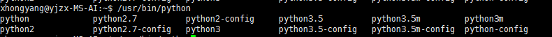

# 关于服务器上python环境的搭建及安装包的安装

基于ubuntu系统

## 1、 虚拟环境搭建

- step 1 系统python环境安装virtualenv包

```
pip install virtualenv  (当存在多个python版本时，注意pip的版本，有的可能是pip3)
```

- step 2 新建虚拟环境

查看系统可用python解释器的版本，终端键入`/usr/bin/python` 然后按tab键，如下图：



新建环境指令：

```
virtualenv -p /usr/bin/python3.5 venv
```

解释： virtualenv 调用功能包；
            -p 制定python解释器的路径及版本；
            venv 新建虚拟环境的路径及名称，名称可随意取。
执行后如下图所示：


- step 3 启动环境

```
source venv/bin/activate
```

解释： 执行路劲下的 activate 文件

环境启动后，出现（venv）标识，如下图所示：


- step 4 关闭环境

```
deactivate
```

## 2、自动批量安装项目依赖包

- 单独安装一个包的时候使用的是 `pip install package_name(=version) (-i source link)`

```
pip install tensorflow-gpu
pip install tensorflow-gpu==1.15.0
pip install tensorflow-gpu==1.15.0 -i https://mirrors.aliyun.com/pypi/simple/
```

解释： 完整的指令，使用阿里云的源，安装tensorflow-gpu的1.15.0版本，使用国内源可以加速下载。不指定时使用国外的官方源。不指定版本的时候将下载最新的版本。

- 当pip网速不稳定的时候，也可以先手动下载对应版本的安装包`*.whl`文件，在使用pip 安装。

```
pip install package_file_path
```

- 当使用pip安装一个大型的库时，其相关的必须依赖，一般会自动链接安装


- 批量安装项目依赖用requirement.txt

requirements.txt的内容如下形式：


第一行可以加上 `-i https://mirrors.aliyun.com/pypi/simple/`以指明下载的源

```
pip install -r requirements.txt
```

注意：批量安装的原理是统一下载后自动安装全部，如果在下载过程中出错，则过程中断，前面已经下载完成的包缓存在虚拟环境中，所有的下载成功后才开始按照顺序安装。安装过程中出错，则过程中断，需要单独解决问题后再重新执行指令。此外有些安装包安装之前就需要系统安装其他的包，此时也需要在执行批量安装前先手动安装该安装包。

