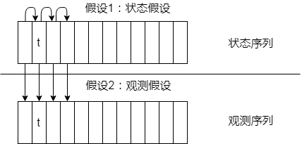
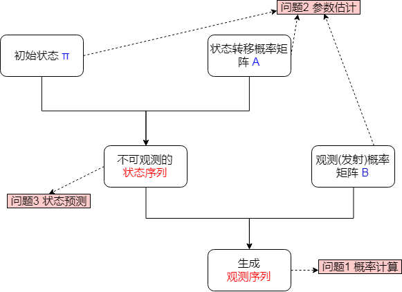
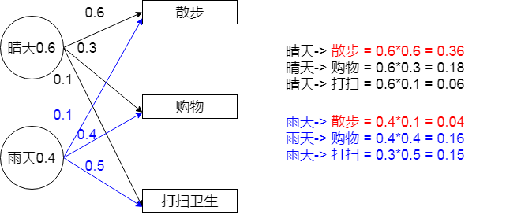
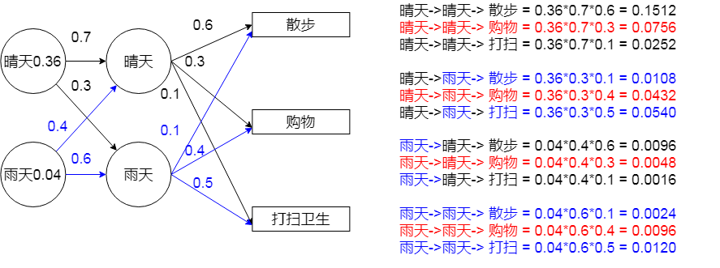
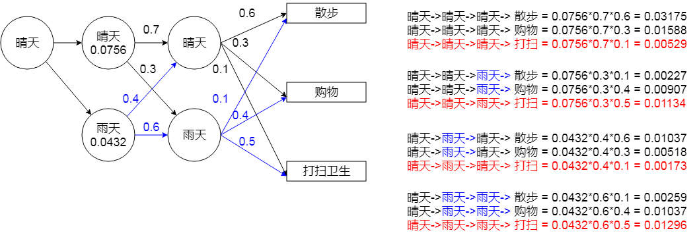
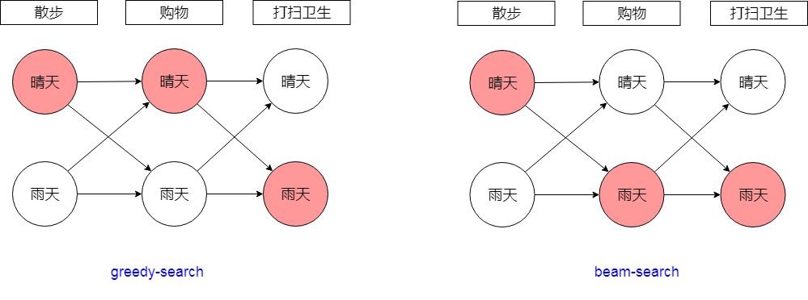
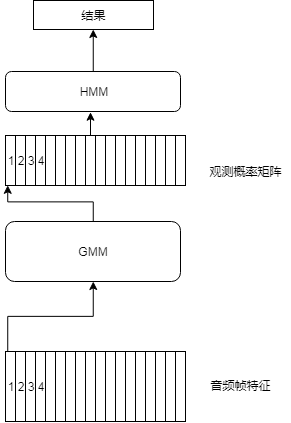
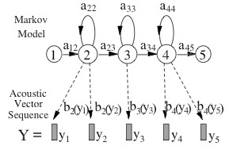

# GMM-HMM 笔记

## 目录

- GMM
- HMM

## 一、GMM

GMM是一种聚类算法，由多个高斯分布组成，理论上是用多个高斯分布去拟合任意一个概率分布。GMM中，每个component就是一个聚类中心。预测时可以给出属于每一个类的概率；GMM聚类可以知道类别数，也可以不用，即在只有样本点，不知道样本分类（含有隐含变量）的情况下进行分类；

GMM可以给出一个样本属于某类的概率是多少.

在语音识别中，首先做的是音素对齐，然后训练识别音素的GMM模型；GMM预测音素，给出观测概率矩阵，再由HMM对观测概率矩阵进行解码，识别出对应的语句。

在kaldi中，则是首先用均匀对齐的方式，训练单因素模型，隔一段时间重新对齐一次最后得到单音素模型；再基于单音素模型的强制对齐结果继续训练三音素模型；

## 二、HMM

​	    隐马尔可夫模型(hidden Markov model,HMM)是关于时序的概率模型，描述有一个隐藏的马尔科夫链随机生成不可观测的状态随机序列（`状态序列`）,再由各个状态生成一个观测而产生观测随机序（`观测序列`）列的过程。

​        隐马尔可夫模型由初始概率分布`π`、状态转移概率矩阵`A`以及观测概率矩阵`B`确定，即 `λ=（A,B,π）` 

### 2.1 马尔科夫过程

​		马尔科夫假设： 随机过程中各个状态`St` 的概率分布，只与它前一个状态`St-1`有关，即`P(st|s1,s2,s3,...,st-1) = P(st|st-1)`

​		符合马尔科夫假设的随机过程叫马尔科夫过程，也叫马尔科夫链。

### 2.2 两个基本假设

- 1、齐次马尔科夫性假设(状态假设)

  即假设隐藏马尔科夫链的任意时刻`t`的状态只依赖于前一个时刻的状态，与其它时刻的状态及观测无关，也与时刻`t`无关.

- 2、观测独立性假设(观测假设)

  即假设任意时刻的观测只依赖于该时刻的马尔科夫链状态，与其它观测及状态无关。

  




### 2.3 三个基本问题

- 1、概率计算问题。

  给定模型 `λ=（A,B,π）` 和观测序列O，计算在模型 `λ`下的观测序列O出现的概率。

  ```
  解法：
  
  - 直接计算法：直接算所有可能的对应观测序列的状态序列的概率，然后求和，计算量太大不可行
  - 前向算法：递推方法求解，每一次的计算直接引用前一个时刻的计算结果，避免重复计算，减少计算量；
  - 后向算法：递推方法求解，由后面的结果倒推前一个时刻的的结果，同上
  ```

  举例：

  已知天气模型`λ=（A,B,π）`，求未来三天的天气为“晴天，雨天，晴天”的概率

- 2、模型训练问题（参数估计）

  已知观测序列O，估计模型  `λ=（A,B,π）` 参数，使得在该模型下观测序列的概率 `P(O|λ)` 最大。

  ```
  解法：
  - EM 算法
  ```

  

- 3、预测问题（状态预测）

  就是解码问题，已知模型  `λ=（A,B,π）` 以及观测序列O，求最有可能的对应的状态序列。

  ```
  解法：
  - 维特比解码
  每步只取最优解时，叫贪婪搜索（greedy-search）
  每步取n个最优解时，叫集束搜索(beam-search)
  ```




### 维特比算法

隐状态 = ['晴天', '雨天']

观测序列 = ['散步', '购物', '打扫卫生']

初始状态：`π = [0.6, 0.4]`

转移概率矩阵：`A = [[0.7, 0.3], [0.4, 0.6]]`

观测概率矩阵：`B = [[0.1, 0.4, 0.5], [0.6, 0.3, 0.1]]`

求 观测序列对于的可能性最大的状态序列即连续三天的天气情况。

| A    | 晴天 | 雨天 |
| ---- | ---- | ---- |
| 晴天 | 0.7  | 0.3  |
| 雨天 | 0.4  | 0.6  |

| B    | 散步 | 购物 | 打扫卫生 |
| ---- | ---- | ---- | -------- |
| 晴天 | 0.6  | 0.3  | 0.1      |
| 雨天 | 0.1  | 0.4  | 0.5      |

P("晴天") = 0.6

P("雨天") = 0.4

第一步：结合初始状态，计算第一天的天气



第二步：结合第一天的天气，计算第二天的天气



第三步：结合第二天的天气，计算第三天的天气



两种结果：



## 孤立词识别GMM-HMM

N个帧对应一个状态

3个状态对应一个音素

N个因素组成一个单词







其中GMM针对帧数据进行聚类，给出每一帧数据属于每个状态的概率。即为观测概率矩阵。

HMM针对音素的持续时间进行建模，转移概率给出一个状态转移到下一个状态的概率，即为转移矩阵。

P(语音，对齐方式| 模型) = GMM观测概率 * HMM转移概率 