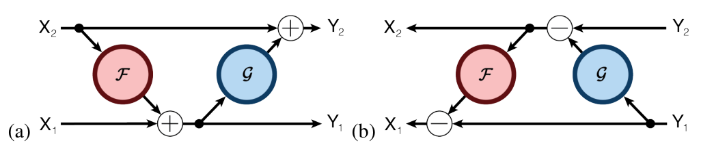
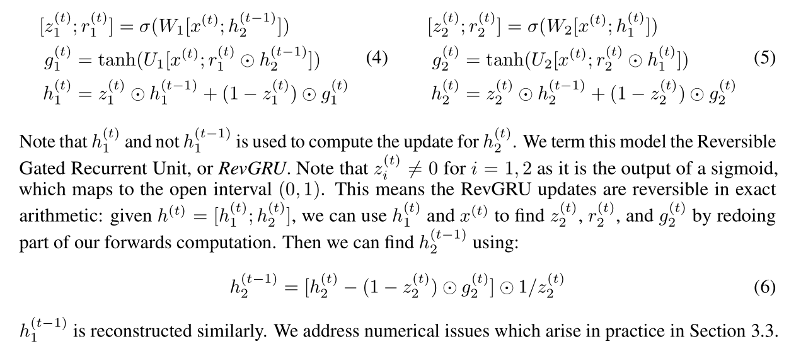
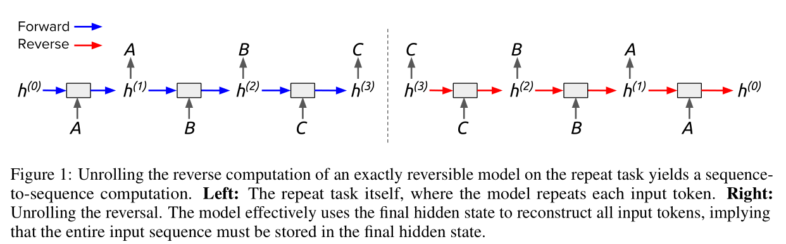
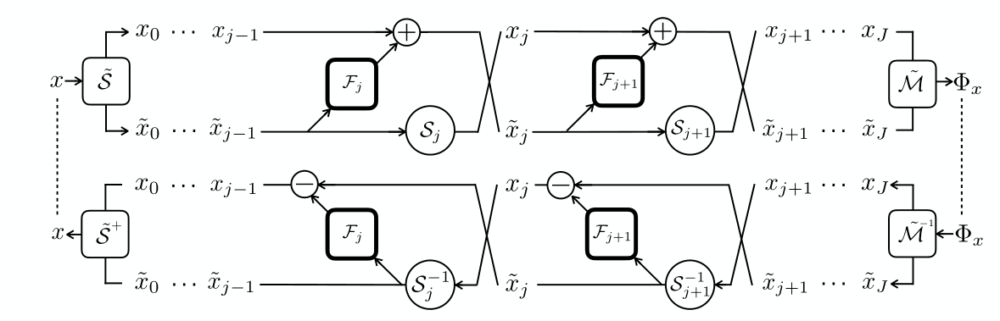

# 可逆神经网络总结

​		基于样本数据去训练神经网络进行预测识别，从本质上来讲，是一个多对一的问题。即，从同一个目标的多种不同形态中去学习发现共有的属性，形成判断的规则。比如语音识别中，一个字的读音是固定的，但是由不同的人来读，男人，女人，老人，小孩，北京人，广东人，实际呈现出来的听觉效果各不相同，语音识别模型就是要从这些各种不同的样本数据中去学习其基本的、共有的发音属性，从而判断其到底说的是哪个字。从样本空间到参数空间，我们可以用明确的函数来定义这种问题形式，这种方法也是目前深度学习方法解决实际问题的主流方法。

​		从样本空间到参数空间的映射，通常称之为前向过程。反过来，从参数空间到样本空间为逆向过程。如果直接用一般的神经网络去训练逆向过程，效果会很有限，因为逆向过程是一对多的，且在前向过程中存在信息丢失情况。这就需要特别设计一种特殊神经网络来实现逆向过程。

### 1、 可逆神经网络原理

​		与一般神经网络相比，可逆神经网络具有三个特征：

-  （i）从输入到输出的映射是双射的，即它的逆存在 

-  （ii）正向和反向映射都是有效可计算的 

-  （iii）映射具有易处理的雅可比行列式，因此概率可以通过变量公式明确转换 

  ​	 下图是一般神经网络与可逆神经网络的对比图： 

​		标准 NN 直接对逆向过程进行训练，但其需要一个监督损失（SL, Supervised Loss）项，来区分真正的 x 与预测的 x（我们可以暂时把 SL 理解为一个确定的代价函数）。而 y->x 这种一对多映射使得传统 NN 受到很大限制。INN 只对前向过程使用 SL，而由于并没有一个确定的 x 值，因此预测的 x 属于无监督损失（USL， Unsupervised  Loss），需要遵循之前的 p(x)；另外，潜在变量 z 需要服从高斯分布，也是属于 USL。

​		由于在前向过程中会丢失一些信息，因此引入了额外的潜在输出变量 z，用来学习与 x 有关的但并未包含在 y 内的信息。此外，需要训练网络根据高斯分布对 p(z) 进行调整。即，`p(x|y) `被调整为一个确定的函数` x = g(y,z)`，这个函数将已知的分布 p(z) 在满足 y 的情况下转换到 x 空间。

### 2、可逆网络架构

​		可逆神经网络的基本构建块是Real NVP模型推广的仿射耦合层。它的工作原理是将输入数据分成两部分 u1、u2，这两部分由学习函数 si，ti`（它们可以是任意复杂的函数，且函数本身不需要是可逆的）`转换并以交替方式耦合：

 

 输出即是 [v1，v2] 的连接。用公式表示为： 

$$
v_1 = u_1  \odot e^{s_2(u_2)} + t_2(u_2) \\
v_2 = u_2  \odot e^{s_1(v_1)} + t_1(v_1)
$$
 而给定输出，也可以得到其逆过程 ：

 

 用公式表示为：  

$$
u_2 = (v_2 - t_1(v_1)) \odot e^{-s_1(v_1)} \\
u_1 = (v_1 - t_2(u_2)) \odot e^{-s_2(u_2)}
$$
​		 INN 同时降低输入和输出域的误差，使得训练更加高效。因此，INN 交替执行前向和后向迭代，在更新参数之前积累双向梯度。 

[参考文献]

[可逆神经网络 Invertible Neural Networks]( https://www.jianshu.com/p/37c482fe4d2a )

### 3、可逆残差网络（Reversible Residual Network）

​		多伦多大学在残差网络的基础上提出了一种可逆残差网络用于解决残差网络在训练过程中的高内存占用问题。残差网络在训练过程中需要存储每一层的激活，用于反向传播时的梯度计算，这也是残差网络在训练过程中占用内存较大的原因。可逆残差网络中，当前层的激活可以由下一层的激活重建，所以只需要存储最后一层的激活即可，从而实现了节省内存的目的。

​		可逆结构如图所示：

​		将输入分为两部分`x1`,`x2`图中（a）为前向（b）为逆向，输出也为两部分`y1`,`y2`其公式如下：

$$
y_1 = x_1 + F(x_2) \\
y_2 = s_2 + G(y_1)
$$
​		反向重建每一层的激活：

$$
x_2 = y_2 - G(y_1)  \\
x_1 = y_1 - F(x_2)
$$
​		与残差网络不同的是，逆向网络的步长必须是1，因为网络层会丢失信息，如果逆向模块中间的网络层数大于1，就无法进行逆向恢复了。

​		此外，本文中的可逆只是局部可逆，整个网络中仍然存在 `max-pooling` 以及 `downsampling` 这样的不可逆层的存在。

[参考文献]

[The Reversible Residual Network:Backpropagation Without Storing Activations]( https://arxiv.org/pdf/1707.04585.pdf )

### 4、可逆循环网络（Reversible Recurrent Neural Networks）

​		同样是多伦多大学团队提出的方法，目标同样是为了减少训练过程中的内存占用量。其思路是让隐藏状态在遗忘信息的同时，隐藏状态之间仍然可以逆向推导。

- GRU

​		GRU是RNN的一个变种，其内部结构图如下：

 

$$
[z^{(t)}; r^{(t)}] = \sigma(W[x^{(t)}; h^{(t-1)}]) \\
g^{(t)} = tanh(U[x^{(t)};r^{(t)} \odot h^{(t-1)}]) \\
h^{(t)} = z^{(t)} \odot h^{(t-1)} + (1-z^{(t)} \odot g^{(t)})
$$
​		可逆结构将隐藏状态h分成两部分 `[h1;h2]` ， 公式如下:

​		根据当前状态`h(t)=[h1(t); h2(t)]`重建`h（t-1）=[h1(t-1); h2(t-1)]`，首先重建`h2(t-1)`，由（5）中公式，根据`h1(t)`和`x(t)`可以得到`z2(t)`和`r2(t)`，再根据`x(t)`、`r2(t)`和`h1(t)`计算得到`g2(t)`，最后由`h2(t)`，`g2(t)`，`z2(t)`重建`h2(t-1)`;

​		然后重建`h1(t-1)`，由（4）中公式，根据第一步重建的`h2(t-1)`和`x(t)`得到`z1(t)`和`r1(t)`，再根据`h2(t-1)`和`x(t)`以及`r1(t)`得到`g1(t)`，最后由`h1(t)`，`g1(t)`，`z1(t)`重建`h1(t-1)`；

​		至此，`h（t-1）=[h1(t-1); h2(t-1)]`重建完成，实现逆向推导。

- LSTM

   LSTM也是RNN的一个变种，其内部结构图如下 

$$
[f^{(t)}, j^{(t)}, o^{(t)}] = \sigma(W[x^{(t)}, h^{(t-1)}]) \\
g^{(t)} = tanh(U[x^{(t)}, h^{(t-1)}]) \\
c^{(t)} = f^{(t)} \odot c^{(t-1)} + i^{(t)} \odot g^{(t)} \\
h^{(t)} = o^{(t)} \odot tanh(c^{(t)})
$$

​		由于`h(t)`和`h(t-1)`不在是非零线性变化，因此不能直接使用前述的可逆结构。其可逆的思路与前述不变，还是分成两部分`c(t)=[c1(t), c2(t)]`，`h(t)=[h1(t), h2(t)]`其实现方法如下：

$$
[f_1^{(t)}, i_1^{(t)}, o_1^{(t)}, p_1^{(t)}] = \sigma(W_1[x^{(t)}, h_2^{(t-1)}]) \\
g_1^{(t)} = tanh(U_1[x^{(t)},h_2^{(t-1)}]) \\
c_1^{(t)} = f_1^{(t)} \odot c_1^{(t-1)} + i_1^{(t)} \odot g_1^{(t)} \\
h_1^{(t)} = p_1^{(t)} \odot h_1^{(t-1)} + o_1^{(t)} \odot tanh(c_1^{(t)})
$$

- 可逆结构的逻辑图

[参考文献]

[Reversible Recurrent Neural Networks]( https://arxiv.org/pdf/1810.10999v1.pdf)

### 5、可逆残差网络

​		依然是基于残差网络的设计，结构如下图所示：

​		网络结构由"卷积瓶颈（convolutional bottlenecks）`Fj`"和“重组操作（reshuffling operations）`Sj`”两步交错连接组成；

​		正向过程时输入使用分割算子`S`将x分为两部分，输出用合并算子`M`进行合并。

​		逆向过程时输入使用合并算子`M-1`进行分割，输出用合并算子`S-1`进行合并。

​		计算公式如下：
$$
\begin{cases}
x_{j+1} = S_{j+1}\hat{x_j} \\
\hat{x}_{j+1} = x_j + F_{j+1}\hat{x_j} \\
\end{cases} \Longleftrightarrow 
\begin{cases}
\hat{x_j} = S^{-1}_{j+1} x_{j+1} \\
x_j = \hat{x}_{j+1} - F_{j+1}\hat{x}_j \\
\end{cases}
$$
[ i-REVNET: DEEP INVERTIBLE NETWORKS ]( https://arxiv.org/pdf/1802.07088.pdf )

### 6、可逆残差网络

​		由陈天奇等人提出的，同样是基于残差网络，但是相比于前面几种从结构上创新来实现可逆操作的思路不同，陈天奇等人从公式的角度推导出网络可逆的约束条件，通过施加约束条件实现残差网络可逆。

​		可逆网络的三个问题：

​		1：什么时候可逆？
​		2：逆函数是什么？
​		3：雅可比行列式怎么算？

 		如果只做分类问题，那么保证第一点就行了；如果做重构图片，那么就需要第二点；如果用最大似然来训练生成模型，那么就需要第三点。 

​		第一个问题：

​		ResNet的基本模块如下：
$$
y = x + g(x) \triangleq F(x)
$$
​		如果每个基本模块可逆，则网络可逆，模块可逆的充分条件是：
$$
Lip(g) < 1
$$
​		其中：
$$
Lip(g) \triangleq \max_{x_1 \neq x_2} \frac{\parallel g(x_1) -g(x_2) \parallel_2}{\parallel x_1 - x_2 \parallel_2}
$$

​		是函数 g 的 Lipschitz 范数。也就是说，g 的 Lipschitz 范数小于 1，就能保证 (1) 可逆了。g 是神经网络，卷积和全连接都无妨，神经网络是由矩阵运算和激活函数组合而成的，即代表结构是 ：
$$
Activation(Wx + b)
$$
​		 “g 的 Lipschitz 范数小于 1”的一个充分条件是“Activation 的 Lipschitz 范数不超过 1”且“Wx+b 的 Lipschitz 范数小于 1”。而 Activation 只是个标量函数，“Lipschitz 范数不超过 1”意味着导数不超过 1 就行了，目前我们常用的激活函数（sigmoid、tanh、relu、elu、swish 等）都满足，所以这一点不用管它；而“Wx+b 的 Lipschitz 范数小于 1”，意味着矩阵 W 的 Lipschitz 范数小于 1。 

​		 矩阵 W 的 Lipschitz 范数其实也就是“谱范数” ， 对模型 g 的所有核权重 W 做谱归一化，然后乘上一个大于 0 小于 1 的系数 c（即），就可以使得 `x+g(x)` 可逆了。 

​		第二个问题：

​		当 `Lip(x) < 1` ， 网络可逆，则 `y=x+g(x)` 是可逆的，那么我们要想办法求出逆函数 `x=h(y)` ，考虑迭代：
$$
x_{n+1} = y - g(x_n)
$$
 		显然，迭代序列 `{Xn}` 是跟 y 有关的，而一旦 ` {Xn}` 收敛到某个固定的函数 ：
$$
\lim_{n->\infty} {x_n(y)} = \hat{h}(y)
$$
​		那么就有：

$$
\hat{h}(y) = y-g(\hat{h}(y))
$$
​		这样就求出了逆函数 `x=h(y)` 。

​		第三个问题：

​		条件依然是 `Lip(x) < 1` 。

[Invertible Residual Networks]( https://arxiv.org/pdf/1811.00995.pdf )

[可逆ResNet：极致的暴力美学 ]( https://www.sohu.com/a/303874715_500659 )

### 7、可逆transformer

​		同样是为了解决模型在训练过程中的高内存占用问题。其问题解决思路与前面的可逆残差网络一致，都是构建一个可逆的模块。不同的是，这里用注意力层来代替F函数，用前馈层替代G函数。公式如下：
$$
Y_1 = X_1 + Attention(X_2) \, \, \, \, \, \, \, \, \,\, \, \,Y_2 = X_2 + FeedForward(Y_1)
$$
​		结构还是如下图所示：

​		此外，结合前馈神经网络的计算特点，可以进行分段处理的方式进一步的降低内存的占用。
$$
Y_2 = [Y_2^{(1)};...;Y_2^{(C)}] = [X_2^{(1)} + FeedForward(Y_1^{1}; ... ;X_2^{c} + FeedForward(Y_1^{c})]
$$
[参考文献]

[REFORMER : THE EFFICIENT TRANSFORMER]( https://openreview.net/pdf?id=rkgNKkHtvB )

