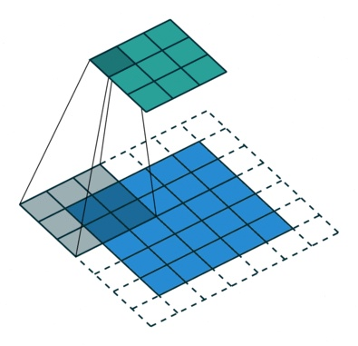
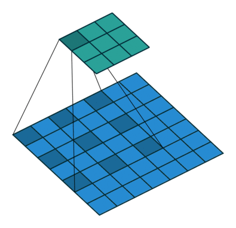
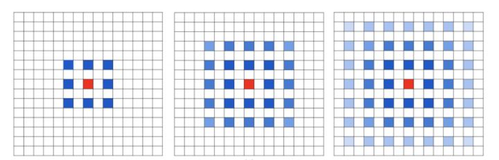
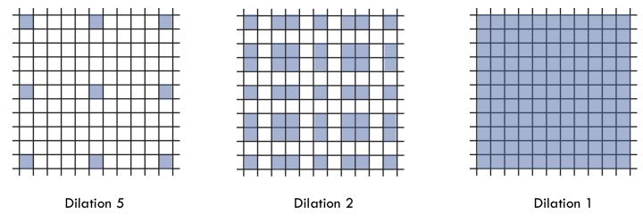

# 空洞卷积(dilated convolution)

## 目录

- 概念
- 卷积网络的问题及解决
- 空洞卷积的问题

### 一、概念

- 感受野（`reception field`）

```
卷积神经网络的每一层输出的特征图上的像素点在原图像上映射的区域大小，即卷积核一次运算包括的范围大小。
```

- 空洞卷积（`dilated convolution`） / 膨胀卷积（`Atrous Convolution`）

```
在标准卷积的 Convolution map 的基础上注入空洞，以此来增加感受野的一种机制。
```

- 空洞率/膨胀率 （`dilation rate`）

```
超参数，指的是 kerne 的间隔数量
```


## 二、卷积网络的问题及解决

#### 2.1 问题		

​		在图像分割领域，一般用 `FCN`（全卷积网络）进行学习。图像输入到 `FCN`中，`FCN` 先像传统的 `CNN` 那样对图像做卷积再 `pooling`，降低图像尺寸的同时增大感受野，但是由于图像分割预测是 `pixel-wise` 的输出，所以要将 `pooling` 后较小的图像尺寸 `upsampling` 到原始的图像尺寸进行预测（`upsampling` 一般采用 `deconv` 反卷积操作）。

因此图像分割 `FCN` 中有两个关键，一个是池化（`pooling`），另一个是上采样（`upsampling`）。

- 池化与上采样的缺陷

```
在FCN（全卷积）网络中，为了解决感受野太小的问题，一般通过池化（pooling）来增大感受野，缩小图像尺寸。然后再用上采样（upsampling）还原图像的尺寸，但是这个先减小再增大尺寸的过程中必然造成了精度的损失。此外池化操作与上采样参数不可学习，人为设定参数太过主观。
```

- 内部数据结构丢失；空间层级化信息丢失
- 小物体信息无法重建 (假设有四个 `pooling layer` 则 任何小于 `2^4 = 16` pixel 的物体信息将理论上无法重建。)

#### 2.2 解决

​		解决办法就是空洞卷积，在不做 `pooling` 损失信息的情况下，加大了感受野，让每个卷积输出都包含较大范围的信息。原理如图：

- 标准卷积（`3 x 3 kernel  and padding`）



- 空洞卷积（`3 x 3 kernel and dilation rate 2`）



- 感受野计算


卷积核为 `3 x 3`，图a中 `dilated_rate = 1` 与普通的卷积操作一样; 图b中 `dilated_rate=2` ; 图c中的 `dilated_rate=4`

在标准的 `CNN` 网络中，感受野的计算公式如下，其中 `m` 为上一层的感受野，`r` 为本层感受野，`stride` 为池化或者卷积的步长，`ksize` 为卷积核大小，初始感受野大小为 `1`：
$$
r = (m-1) x stride + ksize
$$
则：

`CNN1: kernel 3x3 (stride=1)  r=(1-1)x1 + 3 = 3 `;    感受野为 `3 x 3 `

`pooling:kernel 2x2(stride=2)  r=(3-1)x2 + 2 =6` ;    感受野为 ` 6 x 6 `

`CNN2: kernel 3x3 (stride=1)  r=(5-1)x1 + 3 =8` ;     感受野为 `8 x 8`

空洞卷积的感受野计算方法和上面相同，所谓的空洞可以理解为扩大了卷积核的大小：

`1-dilated conv： kernel 3x3(stride=1) r=(1-1)x1 + 3 = 3` ;     感受野 `3 x 3`

`2-dilated conv： kernel 5x5(stride=1) r=(3-1)x1 + 5 = 3` ;     感受野 `7 x 7`

`4-dilated conv： kernel 9x9(stride=1) r=(7-1)x1 + 9 = 3` ;     感受野 `15 x 15`

空洞卷积的感受野计算公式为 :
$$
r = 2^{(\frac{rate}{2} + 2)} - 1
$$
普通卷积的感受野与层数成线性关系，空洞卷积的感受野成指数关系。

## 三、空洞卷积的问题及解决办法

### 3.1 问题

#### 3.1.1 The Gridding Effect

​		假设我们仅仅多次叠加 dilation rate 2 的 `3 x 3` kernel 的话，则会出现下图所示问题：



​		可以发现 `kernel` 并不连续，也就是并不是所有的 `pixel` 都用来计算了，会损失信息的连续性（栅格效应，膨胀卷积不能覆盖所有的图像特征）

#### 3.1.2 Long-ranged information might be not relevant

​		`Dilated Convolution` 的设计更像是用于获取 `long-range information`，这样或许对一些大物体有较好的分隔效果，而对于小物体来说可能是有弊无利了。如何同时处理好大小物体的关系，则是设计好 `dilated convolution` 网络的关键。


### 3.2 解决办法

​		`HDC (Hybrid Dilated Vonvolution)` 混合空洞卷积是针对空洞卷积存在的问题所提出的，对比一般空洞卷积，主要包含以下三方面的特征：

- 叠加的空洞卷积的空洞率 `dilated rate` 不能有大于1的公约数（比如 `[2, 4, 6]`），不然会产生栅格效应

- 空洞率 `dilated rate` 设计成了锯齿状结构，例如 `[1, 2, 5, 1, 2, 5]` 这样的循环结构

- `dilated rate` 需要满足：

$$
M_i = max[M_{i+1} - 2r_i, M_{I+1} - 2(M_{I+1} - r_i), r_i]
$$

  其中 是 `i` 层的 `dilation rate` 而 是指在 i 层的最大dilation rate，那么假设总共有n层的话，默认  。假设我们应用于 `kernel` 为 `k x k` 的话，我们的目标则是，这样我们至少可以用 `dilation rate 1` 即 标准卷积网络的方式来覆盖掉所有洞。

一个简单的例子: `dilation rate [1, 2, 5] with 3 x 3 kernel `(可行的方案)：



​		而这样的锯齿状本身的性质就比较好的来同时满足小物体大物体的分割要求(小 `dilation rate` 来关心近距离信息，大 `dilation rate` 来关心远距离信息)。