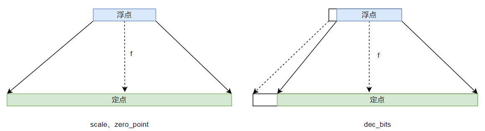
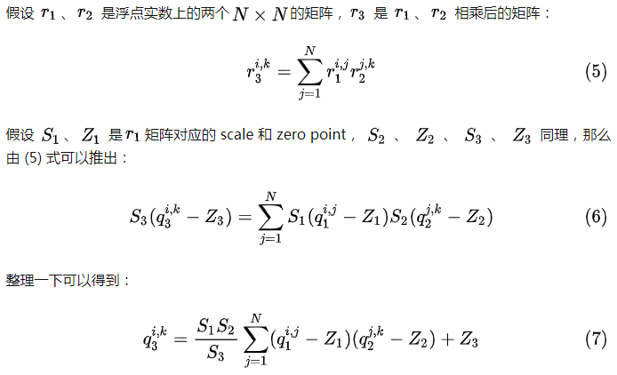

# 定点量化的学习笔记

首先讨论一个问题，“`定点化`”与“`量化`”有什么区别？

一开始我也被这个问题迷惑，第一反应是两者是一样的，因为过程很像。然后再仔细想想，好像又不对。在模型移植中我们一般称“量化”，在硬件应用场景中我们多称为“定点化”，似乎“定点化”的概念范围要比“量化”的概念范围大？那么事实是这样吗？

要回答这个问题，需要先理解这个问题的内容。比如什么叫“定点化”？“定点”是指什么？“量化”是什么意思？搞清楚这几个概念就能明白问题的核心点在哪里。

`定点`是一种数据格式，与`浮点`相对应。二者在表示范围和精度上存在较大的差距。浮点数表示的`范围大，精度高`，定点数表示的`范围小，精度低`。

`量化`在数字信号处理领域，是指将信号的连续取值（或者大量可能的离散取值）近似为有限多个（或较少的）离散值的过程。量化主要应用于从连续信号到数字信号的转换中。连续信号经过采样成为离散信号，离散信号经过量化即成为数字信号。换句话说，`量化`是一种将`无限（高精度）量`转化为`有限（低精度）量`表示的`过程`。结合映射的概念，量化也是一种映射，从高精度到低精度的映射。

将浮点数转为定点数，这个过程可以叫（浮点数的）`定点化`（从数据格式变化的角度），也可以叫`量化`（浮点数）（从过程性质的角度），也可以叫`定点量化`（目标是定点，过程是高精度转低精度）。所以在浮点数转定点数这个应用场景中，定点化与量化是一样的，就是对一个计算过程的多角度命名。

所谓模型量化，这里我们用来描述把基于高精度浮点(Floating-point)数推理的模型转化为基于低精度定点(Fixed-point)数推理的模型的过程，例如把`float32` 精度的浮点数据推理过程转化为`int8`精度的定点数推理过程。量化之后，模型体积缩减为原来的`1/4`，计算速度也因为硬件平台的定点计算加速而变快。量化是主要的模型压缩技术之一，主要用于将模型端侧移植中，目的是缩减模型体积和提升计算速度。本文除非明确说明，一般默认为`int8`（8bit）量化。


# 目录

- 量化的基本概念和原理
- 模型量化的主要内容、方法及策略
- 主流平台的量化实现支持


## 1、量化的基本概念和原理

### 1.1 浮点与定点

​		定点（fix point）是一种数据格式，定点格式即约定机器中所有数据的小数点位置固定不变，定点保留特定位数整数和小数，通常将定点数据表示成纯小数或纯整数，为了将数表示成纯小数，通常把小数点固定在数值部分的最高位之前；而为了将数表示成纯整数，则把小数点固定在数值部分的最后面。这里的小数点在机器中是不表示出来的，而是事先约定在固定的位置。对于一台计算机，一旦确定了小数点的位置，就不再改变。

​		与之对应的，还有一种格式叫浮点（float point），浮点数利用科学计数法来表达实数，即用一个尾数(Mantissa，尾数有时也称为有效数字，它实际上是有效数字的非正式说法)，一个基数(Base)，一个指数(Exponent)以及一个表示正负的符号来表达实数。 浮点格式的小数点位置是不固定的，其利用指数达到了浮动小数点的效果，从而可以灵活地表达更大范围的实数。

 		比如：

| format | fixed point | floating point  |
| ------ | ----------- | --------------- |
| 十进制 | 25.125      | 2.5125 * 10 **1 |
| 二进制 | 11001 001   |                 |

​		定点数中，小数点左侧为整数，右侧为小数位；

​		浮点数中左侧为有效数字（尾数，Mantissa）右侧为基数(Base)和指数（exponent） 。

这里有几点需要说明：

- 1、定点数是在计算机中表示数字的一种方式，它既可以表示整数，也可以表示小数;

- 2、受限于小数点的位置，用定点数表示小数时，数值的范围和小数精度是有限的;

- 3、在现代计算机中，定点数通常用来表示整数，对于高精度的小数，通常用浮点数表示;

- 4、模型量化中是将浮点小数转换为定点整数;

###  1.2 Q格式

​		Q格式是二进制的定点数表示格式，表示形式为`Qm.n`其中的`.`即为小数点，m表示整数位的长度，n表示小数位的长度；`UQm.n`表示无符号数，值全为正整数，`m+n`的值即为数据的二进制位数；`Qm.n`表示有符号数，一般最高位为符号位，其值可正可负，数据的二进制位数为`m+n+1`。当n=0时，Q就是整数；当m=0时，Q就是小数。当数据的二进制位数确定时，`Qm.n`也可以写成`Qn`，比如Q5.2可以用8位的Q2表示；

​		也有文章用Q表示法和S表示法对上述情况进行区分，其中S表示法即为`Qm.n`形式，Q表示法为`Qn`形式。

​		以`int8`类型的数据为例,常见的有符号数据和无符号数据类型如下:

| 格式  | 表示的浮点数值域 | 公式                                  | 最大定点数的二进制 | 定点数范围  |
| ----- | ---------------- | ------------------------------------- | ------------------ | ----------- |
| Q5.2  | [-16, 16.75]     | [-2 ** (m-1), 2\*\*(m-1) - 2\*\*(-n)] | 0111 11.11         | [-128, 127] |
| UQ5.3 | [0, 31.75]       | [0, 2\*\*m - 2\*\*(-n)]               | 1111 1.111         | [0, 255]    |

### 1.3 量化：浮点转定点

​		确定定点数的小数点的位置也叫数的**定标**，采用Q表示法的`Qn`形式（或者S表示法的`Qm.n`形式），n的值表示了定点数的n种标定。以8位的定点数为例，Q2（Q5.2）表示小数点在第5位与第6位之间，Q3（Q4.3）表示小数点在第4位与第五位之间；不用的n值表示数不仅范围不同，精度也不同；n值越大，表示的数值范围越小，精度越高；反之，n值越小，数值范围越大，精度越低。

​		比如： Q0（Q7.0）, 数值范围是[-128,127]，精度是1；

​					 Q7（Q0.7）,数值范围是[-1, 0.9921875]，精度是 1/128 = 0.0078125；

​		在定点数中，数值范围与精度是相矛盾的，想要大的数值范围，就必须降低数据精度；反之想要高的精度就必须减小数值范围。

​		数据定标后，浮点转定点的量化公式：
$$
X_q = (int)(x * 2^n)
$$
​		定点转浮点的反量化公式：
$$
x = (float)(X_q * 2 ^ {(-n)})
$$
​		由于二进制的特性，定点数并不能一定完全无损的表示任意小数，所以有时候浮点转定点会存在定点误差，`无损定点`是指满足“无损条件”即定点误差小于精度的一半。

### 1.4 定标：dec_bits

​		量化是一种映射，定标实际上可以看做是确定映射关系`f`，因此准确定标是量化可用的前提。 前面提到，位数确定的情况下，不同的标定可以表示不同范围的数据，那么知道数值范围就可以与对应范围的标定进行匹配，进而完成定标。实际应用中，针对单个数的定标比较简单，可直接根据数值范围和精度进行匹配；而针对数组的定标就需要进行数据统计，获取数组的最大、最小值，并根据最大最小值计算出其小数位**`dec_bits`**，计算公式如下（默认8位有符号数）：
$$
dec\_bits = {7 - ceil(log_2(max({|r_\max|, |r_\min|})))}
$$
​		其中`log2`运算得到的是整数位，总的位置减去整数位得到的就是小数位。这个就是定标。

​		这种定标方法实际上默认了0值在定点化前后是不变的，这种量化的方法优点是简单直观，计算方便。缺点也很明显，实际上是将[-max_value, max_value - 1/128]范围的数据映射到[-128, 127]范围。真实数据只是[-max_value, max_value - 1/128]的一个子集。存在量化空间浪费，在某些极端情况下量化误差会较大。这种量化，其实就是`对称量化`，后边会提到这个概念。

### 1.5 量化与反量化

​		**`量化`**，`float32` 转 `int8`，用`dec_bits`计算公式如下：
$$
q = round(r * 2^{dec\_bits})
$$
​		**`反量化`**，把量化成`int8`的数组再反量化成`float32`的数组，用`dec_bits`计算公式如下：
$$
r = {q \over 2^{dec\_bits}}
$$


### 1.6 量化：基于scale 、zero_point

​		定标是用数据的绝对最大值来确定映射关系`f`，这种方式默认了0值不变。 实际应用中待量化的数据分布并不会总是均匀分布在定标的范围，就导致量化空间浪费和较大的量化误差。理论上，越是均匀的映射，误差越小，效果越好。因此，直接根据真实的数据范围来确定映射关系`f`的方法理论上是比`dec_bits`定标法要好。

​		真实范围映射这种方法要计算`scale` 以及`zero_point`两个参数。这两个量化参数与四个统计值有关，分别是r_max，r_min，q_max，q_min，即待量化数组的最大值和最小值，量化成定点数的最大值和最小值。

​		**`scale`** 是缩放系数，一般计算公式如下：
$$
S = {{r_\max - r_\min} \over {q_\max - q_\min}}
$$

$$
其中 r_\max 和 r_\min 是数组r的最大值和最小值， q_\max 和 q_\min 是量化后定点数取值范围最大值和最小值.
$$

​		**`zero_point`**，顾名思义就是零点的位置：
$$
Z = {round(q_\max - {r_\max \over S})}
$$
​		定点整数的 zero_point 就代表浮点实数的 0，二者之间的换算不存在精度损失。 这么做的目的是为了在 padding 时保证浮点数值的 0 和定点整数的 zero_point 完全等价，保证定点和浮点之间的表征能够一致.

​		量化计算公式如下：
$$
q = round({r \over S} + Z)
$$

​		反量化计算公式如下：
$$
r = S * (q - Z)
$$

​		观察公式可知，零点不一定为0，这种量化方法其实就是`非对称量化`，后边也会提到这个概念。


### 1.7 两种量化方法比较

​		显然，基于`scale`，`zero_point`的量化方法，其零点是变动的，可以充分的利用量化空间；基于`dec_bits`定标的量化方法，其零点是固定的，在极端情况下会存在一定的空间浪费。二者的区别可以用下图来说明：



​		左侧为基于`scale`，`zero_point`的量化体系，右侧为基于`dec_bits`定标的量化体系。

​		两种量化方法的核心区别就是对零点的处理不一样，二者各有优劣，实际应用中可视具体的情况选择合适的方法。那么有一个问题，当零点恰好都在0处时，两种量化方法哪个更好呢？显然，零点都在0处时，二者其实是等价的。

- 例如：

```
浮点数据: r = [0.002, 0.458, 6.589, -1.256, -9.001]
量化目标：有符号int8, q_max=127, q_min=-128
max_val = 6.589, min_val = -9.001;

1、基于scale、zero_point进行直接量化：
scale = (max_val - min_val) / (q_max - q_min) = 0.06113725
zero_point = q_min - round(min_val/scale) = 19
q_1 = round(r/scale + zero_point) = [19, 26, 127, -10, -128]

2、基于dec_bits进行定标量化
int_bits = int(np.ceil(np.log2(max(abs(max_val), abs(min_val)))) = 4
dec_bits = 7-4=3
q_2 = round(r*2**dec_bits) = [0, 4, 53, -14, -72]

3、零点处理 zero_point=0
int_bits = int(np.ceil(np.log2(max(abs(max_val), abs(min_val)))) = 4
dec_bits = 7-4=3
new_max_val = 2**int_bits - 2 **(-dec_bits) = 2**4 - 2**(-3) = 15.879
new_min_val = - 2**int_bits = -2**4 = -16

new_scale = (new_max_val - new_min_val) / (q_max - q_min) = 0.125
zero_point = q_min - round(new_min_val/new_scale) = 0

q_3 = round(r/scale + zero_point) = [0, 4, 53, -14, -72] 
q_3 = q_2
此时可以看到，两种方式的量化结果一致；
```

​		

## 2、模型量化主要内容、方法及策略

### 2.1 内容：权值量化与激活量化

​		模型量化分为两部分，一个是`权值量化`，一个是网络输入与输出的量化，也叫`激活量化`。

- 权值量化

​        权值量化，当模型训练之后，权值一般固定下来不再变化，量化需要的统计参数`r_min`, `r_max`可以直接得到，所以一般这部分的量化可以按照量化公式直接进行计算。

- 为什么有激活量化？

​		**激活量化**不是**激活函数量化**，这里所说的激活量化是指矩阵运算后的输出，通常不包括激活函数（部分激活函数比较简单可以直接使用时可以包括在内），神经网络本质上是输入与权值两个矩阵之间的运算，输出即为运算结果。模型量化，将权值量化为`int8`，同样的输入数据也需要量化到相同精度下，矩阵之间在`int8`精度下完成计算后的输出也同样需要保持在该精度下, 因此对于输出，也要有确定的量化参数。具体可以参考如下公式[神经网络量化入门--基本原理](https://zhuanlan.zhihu.com/p/149659607)理解：



- 激活量化的一般方法

​		模型的输出不是固定的，激活部分的统计参数`r_min`, `r_max`必须要对输入和输出的数据进行统计后才能得到，所以激活量化一般需要一定量的真实样本数据输入模型，得到对应的输出，然后从输出中统计出对应的`r_min`, `r_max`。


### 2.2 量化方法

#### 2.2.1 对称量化和非对称量化

​		所谓`对称量化`就是将浮点数组`[min, max]`扩充成以0点对称中心的浮点数值区间`[-max, max]`，对扩充的对称区间进行量化，零点为0。

​		`非对称量化`就是浮点数组不以0点为对称中心，量化后的零点也不再是0。

​		对称量化对正负数均匀分布的数组比较有效，对分布不均的数组效果不好，比如数组全为正数时，对称量化到`[0,127]`,而`[-128,0]`则浪费掉。非对称量化虽然可最大程度的利用好量化空间，但是由于零点变动，所以需要额外增加关于零点的计算。

#### 2.2.2 逐层量化、逐组量化以及逐通道量化

​		根据量化参数的共享范围来划分可以分为逐层、逐组以及逐通道量化三种。所谓逐层量化就是每层网络共享一组量化参数（dec_bits 或 scale、zero_point），逐组量化就是以组为单位共享一组量化参数（dec_bits 或 scale、zero_point）, 逐通道量化则是指在卷积网络中，针对数据的每层通道都独立使用一组量化参数（dec_bits 或 scale、zero_point）。


### 2.3 量化策略

#### 2.3.1 训练后量化（Post Train Static Quantization，PTSQ）

​		顾名思义，训练后量化是针对已完成训练的模型， 此时权值固定不再改变，可直接按照量化公式进行量化。激活量化部分需要一定的真实数据，经过统计后获取相应的统计参数，然后再按照量化公式进行量化。

​		量化并不能保证是无差别的映射，因为量化本身存在误差，由于权值不变，量化之后权值结构改变，非常容易出现模型性能大幅度下降。实际应用中，虽然可以根据数据分布情况来调整量化方法，但也只能是尽可能的减少误差，并且这种误差在模型推理中会随着网络层数累积，所以越复杂的模型越容易出现问题。

#### 2.3.2 量化感知训练（Quantization Aware Training, QAT）

​		量化感知训练，也就是带训练的量化。模型权值不变时，量化误差会随着网络层数增加逐层累积，最终造成量化失败。而量化感知训练就是针对这种情况，该方法在进行基本的量化操作的同时会根据量化引入的误差来调整模型权值，降低量化误差，从而减少量化误差对模型性能的影响。通过这种训练量化可以有效的减小量化造成的效果损失，甚至能够带来效果提升。


## 3 量化工具支持

### 3.1 tf1

- 训练后量化

在`tf1`版本中提供了激活量化的`API`，即`tf.fake_quant_with_min_max_vars `.

根据[ML-KWS-for-MCU](https://github.com/ARM-software/ML-KWS-for-MCU/blob/master/quant_models.py)中的使用样例，如果模型包含`bn`层，则首先将`bn`与`conv`进行合并，然后采用`dec_bits`移位计算的方式对权值进行量化。将量化的权值再反量化回去，替换掉原来的权值（量化-反量化 之间存在误差）。然后使用`tf.fake_quant_with_min_max_vars `接口统计每层网络输出（激活）的值域范围，即量化可以表示的浮点数值范围[min, max]，源代码对应的是act_max参数，形式如下。

```
x = tf.fake_quant_with_min_max_vars(x, min=-act_max, \
               						max=act_max-(act_max/128.0), num_bits=8)
```

量化后的数值范围为`[-128, 127]`。act_max取值一般为2的指数（保证移位计算的操作和scale、zero_point计算结果一致），最大值可取`2**7`。每层对应一个act_max参数， act_max值确定后，量化的取值范围`[min, max]`也就确定了`[-act_max, act_max-(act_max/128.0)]`，在实际量化时，x的所有元素值会被限制在这个范围内（clip操作），并按照这个范围计算scale和zero_point，然后进行量化转化为`int8`型。

```
这个过程，可以换个角度讲就是，统计出激活部分的最大值和最小值，然后找到距离这个最大值、最小值最近的由2的指数计算的取值范围[-2**n, 2**n - (2**n/128.0)]，用这个范围计算量化参数scale和zero_point，然后用量化参数进行激活量化。(此时scale和zero_point量化计算和dec_bits移位量化计算是等价的，所以权值量化用dec_bits，激活量化用scale和zero_point)
```

- 量化感知训练（待完成）


### 3.2 tf2

待完成

### 3.3 pytorch[详细过程](https://zhuanlan.zhihu.com/p/299108528)

- 训练后量化

```
后端设置：torch.backends.quantized.engine = "qnnpack" / "fbgemm"

1，fuse_model
torch.quantization.fuse_modules(model, [['conv1', 'bn1', 'relu1']], inplace=True)

2, 设置qconfig
q-config: torch.quantization.get_default_qconfig('qnnpack')

3, prepare
torch.quantization.prepare(moderl, inplace=True)

4, 喂数据，不需要反向传播

5， finish quant
torch.quantization.convert(model.eval(), inplace=True)

模型部分：
self.quant_in = QuantStub()
self.dequant = DeQuantStub()
def forward（）：
    x = self.quant_in(x)
    ...
    x = self.dequant(x)
    return x
```

- 量化感知训练

```
过程与前面类似，部分改动
2, 设置qconfig
q-config: torch.quantization.get_default_qat_qconfig('qnnpack')

4， 喂数据，加反向传播
```


# 参考链接

1、[【什么是定点数】](https://zhuanlan.zhihu.com/p/338588296)

2、[【Q格式】](https://zh.wikipedia.org/wiki/Q%E6%A0%BC%E5%BC%8F)

3、[【pytorch的量化- Gemfield】](https://zhuanlan.zhihu.com/p/299108528)

4、[【神经网络量化入门--基本原理】](https://zhuanlan.zhihu.com/p/149659607)

5、[【神经网络量化入门--后训练量化】](https://zhuanlan.zhihu.com/p/156835141)

6、[【神经网络量化入门--量化感知训练】](https://zhuanlan.zhihu.com/p/158776813)

7、[【神经网络量化入门--Folding BN ReLU】](https://zhuanlan.zhihu.com/p/176982058)

8、[【神经网络量化入门--激活函数】](https://zhuanlan.zhihu.com/p/353440096)

9、[ tf.quantization.fake_quant_with_min_max_vars ](https://tensorflow.google.cn/versions/r1.15/api_docs/python/tf/quantization/fake_quant_with_min_max_vars?hl=enps://www.cnblogs.com/liaohuiqiang/p/7673681.html)

10、[【模型量化详解】](https://blog.csdn.net/WZZ18191171661/article/details/103332338?spm=1001.2101.3001.6650.6&utm_medium=distribute.pc_relevant.none-task-blog-2%7Edefault%7EBlogCommendFromBaidu%7Edefault-6-103332338-blog-114483073.pc_relevant_default&depth_1-utm_source=distribute.pc_relevant.none-task-blog-2%7Edefault%7EBlogCommendFromBaidu%7Edefault-6-103332338-blog-114483073.pc_relevant_default&utm_relevant_index=8)